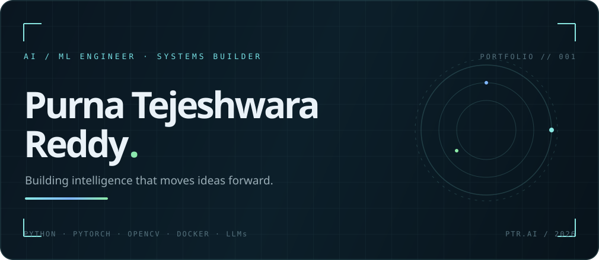
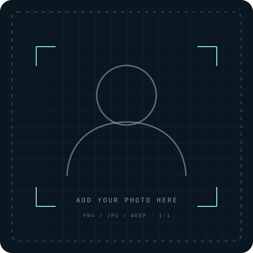
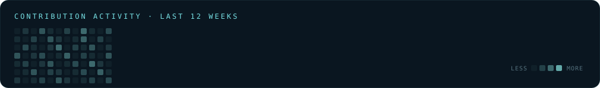
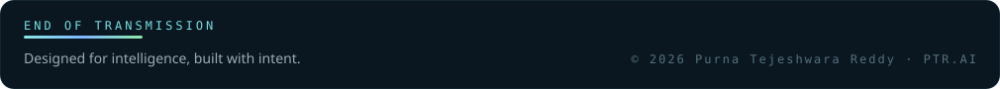

<div align="center">
<a href="https://github.com/Purnatejeshwarareddyb">
  
</a>
</div>
<br />
<table>
<tr>
<td width="31%" valign="top" align="center">
<br />
<picture>\n  <source srcset="./assets/profile/profile.png" type="image/png" />\n  <source srcset="./assets/profile/profile.webp" type="image/webp" />\n  \n</picture>
<br />
PURNA TEJESHWARA REDDY
`AI / CV / FULL-STACK`
<br />


> Turning ideas into deployable systems.
<br />


</td>
<td width="69%" valign="top">
```text
> boot portfolio --identity=purna

  NAME       Purna Tejeshwara Reddy
  ROLE       AI / ML Engineer · Systems Builder
  LOCATION   Phagwara, Punjab, India
  EDUCATION  B.Tech CSE · LPU · CGPA 6.61
  FOCUS      AI/ML · Computer Vision · DevOps
  STATUS     building / learning / shipping
```

SIGNAL / ABOUT
I build practical software at the intersection of machine learning, computer vision, and deployment. My work moves from model experiments to usable systems — with a current focus on intelligent tools, reliable pipelines, and the foundations behind agentic AI.
```text
[01] learn the fundamentals       [02] build the useful version
[03] measure the result            [04] ship and improve
```
STACK / ACTIVE TOOLING


</td>
</tr>
</table>
<br />

SELECTED BUILDS <sup>04</sup>
<table>
<tr>
<td width="50%" valign="top">
01 / RUPANTARA
Cross-species face generation
A generative computer-vision experiment for identity-preserving transformation and reverse mapping.
`Python` `OpenCV` `GANs`
OPEN REPOSITORY ↗
</td>
<td width="50%" valign="top">
02 / LEGAL NER
Multi-model entity extraction
A comparison of BiLSTM-CRF, DistilBERT, and ALBERT models for legal named-entity recognition — 0.95 F1.
`Python` `PyTorch` `Transformers`
OPEN REPOSITORY ↗
</td>
</tr>
<tr>
<td width="50%" valign="top">
03 / RESUME CI/CD
End-to-end DevOps deployment
A containerized resume preview pipeline built around automated builds, testing, and cloud delivery.
`Docker` `Jenkins` `AWS`
OPEN REPOSITORY ↗
</td>
<td width="50%" valign="top">
04 / AI SWACHHTA MONITOR
Real-time vision monitoring
A cleanliness and environmental surveillance dashboard using object detection, frame enhancement, and scoring logic.
`YOLOv8` `OpenCV` `Python`
OPEN REPOSITORY ↗
</td>
</tr>
</table>
<br />

<br />
<table>
<tr>
<td align="center" width="25%"><b>12+</b><br /><sub>REPOSITORIES</sub></td>
<td align="center" width="25%"><b>100+</b><br /><sub>DSA SOLVED</sub></td>
<td align="center" width="25%"><b>0.95</b><br /><sub>BEST NER F1</sub></td>
<td align="center" width="25%"><b>2027</b><br /><sub>GRADUATION TARGET</sub></td>
</tr>
</table>
NOW / NEXT
NOW	NEXT
Strengthening Python, PyTorch, computer vision, Docker, Git, Linux, and deployment workflows.	Exploring LLM applications, RAG, agent orchestration, vector databases, MCP, and MLOps.
JOURNEY LOG
```text
2025 — PRESENT    Independent AI / ML project builder
2024 — 2027       B.Tech · Computer Science & Engineering · Lovely Professional University
2023               Developer Intern · Yoyo Media Square
```
CONTACT / CONNECT
If you are working on an ambitious AI product, an applied ML problem, or an engineering team that values curiosity and execution, I would love to hear from you.
Email: bpurnatejeshwarareddy@gmail.com
GitHub: Purnatejeshwarareddyb
LinkedIn: purna-t-reddy56
Resume: open PDF
<br />
<div align="center">

</div>
<details>
<summary><b>Profile photo setup</b></summary>
Upload your portrait as `assets/profile/profile.png` or `assets/profile/profile.webp` in this repository. The README already checks those exact locations first, then falls back to the included SVG portrait frame, so the photo will replace the placeholder automatically.
Use a square PNG, JPG, or WEBP image. A clean 600×600 px or larger headshot with a neutral background works best inside the dark dashboard layout.
</details>
