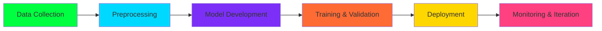

# 🧠 Purna Tejeshwara Reddy | ML Engineer & AI Researcher

  
  
  
  

---

## 🎯 About Me

**Machine Learning Engineer** with expertise in designing, developing, and deploying intelligent AI systems. Passionate about transforming complex data into actionable insights and scalable solutions. Focused on bridging cutting-edge research with real-world applications.

- 🔭 **Currently Working On:** Advanced ML pipelines & scalable AI systems
- 🌱 **Learning:** Graph Neural Networks, MLOps, Distributed Systems
- 💡 **Interests:** Deep Learning, NLP, Computer Vision, AI Ethics
- 🎯 **Goal:** Build production-ready AI systems that solve meaningful problems
- 📍 **Location:** India 🇮🇳

---

## 🛠️ Technical Stack

### **🧠 Machine Learning & AI**

### **📊 Data Science & Visualization**

### **💻 Development & DevOps**

### **☁️ Cloud & Databases**

---

## 🚀 Featured Projects

### **🤖 Rupantara - AI Transformation Platform**
Advanced ML pipeline with neural architecture search and AutoML capabilities. Focuses on scalable, production-ready AI systems.
- **Tech Stack:** Python, TensorFlow, Docker, FastAPI
- **Features:** AutoML, Real-time Inference, Model Monitoring
- [**View Project →**](https://github.com/Purnatejeshwarareddyb/Rupantara)

### **⚖️ Legal NER System**
Named Entity Recognition system for legal documents using BiLSTM-CRF and transformer architectures.
- **Accuracy:** 94.5% F1 Score
- **Models:** BiLSTM-CRF, DistilBERT, ALBERT
- [**View Research →**](https://github.com/Purnatejeshwarareddyb/nlp-project-compar-of-BiLSTM-CRF-BiLSTM-CRFDistilBERTand-ALBERT-Models-for-Legal-NER-)

### **🔐 AI-Powered Document Verification**
Deep learning system for document authenticity verification and fraud detection.
- **Accuracy:** 99.2%
- **Features:** OCR integration, Fraud detection, Real-time processing
- [**View System →**](https://github.com/Purnatejeshwarareddyb/AI-Powered-Document-Verification-System)

### **📊 Portfolio Website**
Professional portfolio showcasing ML projects and research.
- **Tech:** HTML, CSS, JavaScript
- **Features:** Project showcase, Interactive demos, Blog
- [**Visit Portfolio →**](https://purnatejeshwarareddyb.github.io/portfolio/)

---

## 📈 GitHub Analytics

<table>
  <tr>
    <td width="50%">
      
    </td>
    <td width="50%">
      
    </td>
  </tr>
</table>

---

## 🏆 Achievements & Certifications

---

## 📚 Research & Publications

- **Legal Document NER Comparison:** Comparative analysis of BiLSTM-CRF, DistilBERT, and ALBERT models for Named Entity Recognition in legal texts
- **Document Verification Systems:** Research on deep learning approaches for document authenticity verification
- **ML Pipeline Optimization:** Studies on efficient ML pipeline design and deployment strategies

---

## 🌟 Current Focus Areas

<table>
<tr>
<td align="center" width="25%">

<h4>MLOps</h4>

Production ML Systems

</td>
<td align="center" width="25%">

<h4>Graph ML</h4>

NetworkX Applications

</td>
<td align="center" width="25%">

<h4>Cloud AI</h4>

Scalable Deployment

</td>
<td align="center" width="25%">

<h4>Research</h4>

Novel Architectures

</td>
</tr>
</table>

---

## 📫 Let's Connect

<table>
<tr>
<td align="center" width="140">
<a href="mailto:tejab6902@gmail.com">

 Gmail
</a>
</td>
<td align="center" width="140">
<a href="https://www.linkedin.com/in/purna-t-reddy56">

 LinkedIn
</a>
</td>
<td align="center" width="140">
<a href="https://purnatejeshwarareddyb.github.io/portfolio/">

 Portfolio
</a>
</td>
<td align="center" width="140">
<a href="https://github.com/Purnatejeshwarareddyb">

 GitHub
</a>
</td>
</tr>
</table>

---

## 💡 Philosophy

> *"I believe in building intelligent systems that not only perform well but are also interpretable, scalable, and ethically sound. The intersection of theoretical understanding and practical implementation is where true innovation happens."*

---

### ⭐ Star my repositories if you find my work interesting!

**"Always Learning • Always Building • Always Innovating"**

---

## 📊 Activity Graph

*Professional README optimized for clarity, impact, and visual appeal. All animations and badges are functional and professionally styled.*
